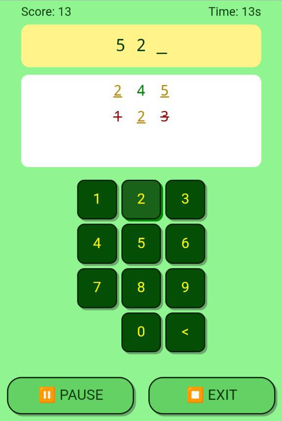

# Solvenius

_Logic game in modern Elm_

## Introduction

Twenty years ago, in 2001, I created the very first version of Solvenius: it was a simple videogame, written in Visual Basic 6, but it still contained most of the game dynamics - in particular, the user had to deduce sequences of digits, à la Mastermind.

About fifteen years later, I discovered [Elm](https://elm-lang.org/), a sublime functional programming language: after the initial challenges due to the new paradigm, I was definitely excited about the well-structured nature of the Elm architecture, so I wanted to try it on a project I knew very well - so, why not Solvenius?

Solvenius 3, which I published in January 2016, was an invaluable breakthrough - which even inspired later projects like [EighthBridge](https://github.com/giancosta86/EighthBridge); however:

- it lacked proper _build automation_
- it was based on the ancient, _signal-based_ Elm architecture
- its _mobile usability_, despite media queries, was limited - which is why I later created a _Kotlin_ wrapper to publish the game to Google Play: but what about iPhone users and non-Android users in general?

Solvenius 4 addresses the above points:

- package dependencies are ensured by Yarn and Elm, while the build process - from code to website - runs via _Webpack_ and _GitHub Actions_

- the code is written in modern, _message-based_ Elm - after 5 years of courses and experience in the domain of functional/hybrid programming; part of the app is also in _TypeScript_ - and the two languages are elegantly mixed by _Webpack_

- in lieu of addressing specific stores, Solvenius is now a _Progressive Web Application_ - that can be installed to a range of different devices!

## Running the game

Solvenius is an HTML 5 game- so you can run it just by pointing your web browser to:

[https://gianlucacosta.info/solvenius](https://gianlucacosta.info/solvenius)

Furthermore, your web browser might even suggest that you install Solvenius - making it feel like a native application! ^\_\_^

## Online help

The game is fairly straightforward - but you can find detailed instructions in the online help, accessible from the title screen.

## Frequently asked questions

- **What's new in this major version?**

  Solvenius 4 introduces the following technical enhancements:

  - **Portable Web Application** (PWA) - to make the game compatible with a wider range of devices, and to make it available even when the user is not connected to the Internet

  - Far more elegant codebase, rewritten in **modern Elm**

  - **Enhanced user interface**:

    - Multiple background music tracks
    - Sounds
    - Game pausing
    - Confirmation messages before exiting the game
    - Path-based page routing - which enables bookmarks to specific pages

  - Browser integration (e.g.: multimedia, local storage) via a thin layer of **TypeScript** code
  - **Webpack** to unify the two different languages into a single JavaScript bundle
  - **Tests**, to check the core parts of the game engine
  - Simple and elegant **build process**, supported by _Yarn_, _Webpack_ and _GitHub Actions_

- **"Solvenius" - what does that mean?**

  _Solvenius_ is short for _solving genius_ - focusing on the deductive nature of the game and the fact that everyone can master its mechanics by applying logic! ^\_\_^

## Audio credits

- The Entertainer by Kevin MacLeod
  Link: https://incompetech.filmmusic.io/song/5765-the-entertainer
  License: https://filmmusic.io/standard-license

- Frogs Legs Rag by Kevin MacLeod
  Link: https://incompetech.filmmusic.io/song/5761-frogs-legs-rag
  License: https://filmmusic.io/standard-license

- Ding sound
  Link: https://djlunatique.com/ding-sound-effect/
  License: https://creativecommons.org/publicdomain/zero/1.0/

**NOTE**: the original audio files have been compressed when creating the game.

## Special thanks (for Solvenius 4)

The author would like to thank:

- _Marco Mengoli_ and _Elisa Bruzzi_: for testing this new release on iPhone, as well as for providing hyper-valuable feedback

## Special thanks (for the legacy version 3)

The author would like to thank - in order by surname:

- _Massimiliano Corsini_: for his valuable testing of both the HTML 5 and the Android version

- _Alberto La Mantia_: for suggesting that game clues on sequence attempts should employ not only colors but also other visual elements

- _Kevin MacLeod_ (incompetech.com): for the excellent soundtrack

- _Salvatore Munaò_: for his valuable testing of both the HTML 5 and the Android version

- _Ivano Pagano_: for suggesting keyboard input support

- _Carmen Squillaci_: for her valuable testing and suggestions on the Android version

- _Paolo Tagliapietra_: for his suggestions and infrastructural support for an older major version (Solvenius 2)

## Further references

- [Elm programming language](https://elm-lang.org/)

- [Beginning Elm](https://elmprogramming.com/)

- [HTML 5](https://www.w3.org/TR/html5/)

- [CSS 3](https://www.css3.info/)

- [Media queries](https://developer.mozilla.org/en-US/docs/Web/CSS/Media_Queries)
